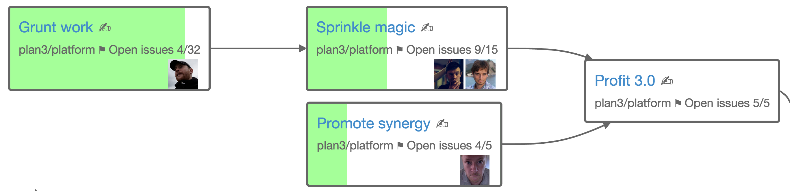

# Stoneboard - A GitHub milestone visualizer

It iterates through all projects a user has access to, in the configured organisations, and fetches milestones and issues. These are then displayed in a graph visualising the milestone relationships.

Specify milestones dependencies by adding this to a milestone description. For example:

`[blah/gh-dashboard-test-three/3 blah/gh-dashboard-test-three/2]`

This tells us the milestone has two dependencies; milestone 2 and 3 in the repo “gh-dashboard-test-three” in the organisation “blah”.



## Rationale

The underlying reasoning behind this style of task visualisation and planning is partly described in the presentation _"[Bastardised Kanban](https://speakerdeck.com/chids/bastardised-kanban)"_ from 2015.

## Local development

### Prerequisites

You will need Java 8 and Maven 3 installed and "properly" setup (in your path etc).

### Setup

Create a file called .env with the variables listed beneath _Configuration_ below.

You can set up a GitHub app for local dev on [https://github.com/settings/applications](https://github.com/settings/applications).

### Start

Start the app with:
    
    $ mvn clean package && foreman start

## Deploy

It's built to run on Heroku with the following configuration:
    
### Configuration

Config variables for local .env and Heroku app:

```
GITHUB_CLIENT_ID=A-GITHUB-CLIENT-ID
GITHUB_CLIENT_SECRET=A-GITHUB-CLIENT-SECRET
GITHUB_HOSTNAME=github.com (optional, used for GitHub Enterprise custom domains)
CALLBACK_URL=https://url-to-app/auth/callback (locally: http://127.0.0.1:5000/auth/callback)
REPOSITORIES=org/repo,org/repo...
```
